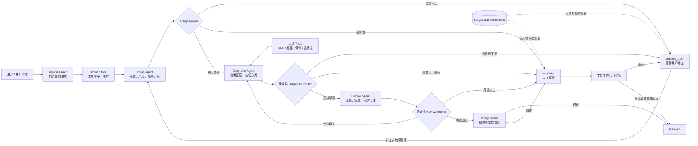
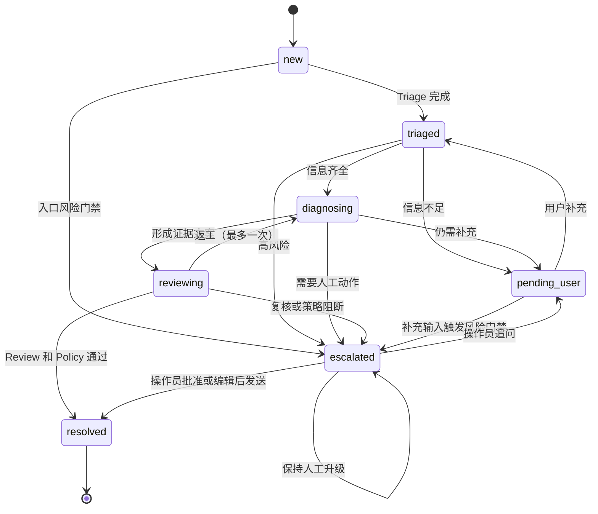

<div align="center">

# 🔐 KeyGuard 2.0｜多 Agent 硬件钱包售后工单协同系统

**面向多 Agent 初学者与 AI 应用岗位的可运行项目**

用 LangGraph 把 Triage、Diagnosis、Review 三个 Agent 编排成一条可暂停、可恢复、可审计的售后工单流程。

[](https://www.python.org/)
[](https://github.com/langchain-ai/langgraph)
[](https://streamlit.io/)
[](https://github.com/ruiqiyang123/ai-hardware-cs-agent/actions/workflows/ci.yml)

[🚀 在线体验](https://ai-hardware-cs-agent.streamlit.app/) · [🎬 5 分钟演示](./docs/DEMO_SCRIPT.md) · [📦 部署说明](./DEPLOYMENT.md)

</div>

---

## 📖 目录

1. [这个项目是什么](#-这个项目是什么)
2. [系统架构：一张工单如何流转](#-系统架构一张工单如何流转)
3. [为什么是三个 Agent](#-为什么是三个-agent)
4. [Router 为什么不是第四个 Agent](#-router-为什么不是第四个-agent)
5. [安全、可靠性与人工接管](#-安全可靠性与人工接管)
6. [四条推荐演示路径](#-四条推荐演示路径)
7. [快速开始](#-快速开始)
8. [测试与评测](#-测试与评测)
9. [项目结构](#-项目结构)
10. [面试高频问题](#-面试高频问题)
11. [简历写法与项目边界](#-简历写法与项目边界)

---

## 🤔 这个项目是什么？

### 用一句话解释

> 普通 AI 客服让一个模型回答全部问题；KeyGuard 让三个职责受限的 Agent 分工处理一张工单，并由确定性代码决定流程何时继续、暂停或转人工。

KeyGuard 使用虚构硬件钱包品牌和模拟业务数据，演示蓝牙连接、固件修复、敏感信息泄露、保修判断等售后场景。它不连接真实钱包、资产、厂商售后或区块链节点。

### 它解决了什么问题？

| 常见 Agent Demo 问题 | 常见做法 | KeyGuard 2.0 |
|---|---|---|
| 模型决定全部流程 | 一次 ReAct 循环自由选择工具 | Router 使用确定性规则控制下一跳 |
| 信息不足时仍然回答 | 依赖 Prompt 提醒模型不要猜 | 进入 `pending_user`，补充信息后恢复 |
| 敏感信息进入历史 | 只在最终回答中隐藏 | Ingress Guard 在持久化之前脱敏 |
| 高风险动作自动执行 | 继续让模型生成步骤 | 进入 `escalated` 和人工工作台 |
| Agent 反复返工 | 没有独立循环边界 | Review 最多退回一次，再失败转人工 |
| 中断后重新开始 | 对话状态只在内存中 | 工单数据库与 checkpoint 分离持久化 |
| 工具事实被自由改写 | 工具结果直接混进模型上下文 | Tool 返回事实，Review 检查证据和引用 |

### V1 → V2

| 维度 | V1：单 ReAct 客服 | V2：多 Agent 工单编排 |
|---|---|---|
| 核心对象 | 一段聊天消息 | 有版本、状态和审计事件的工单 |
| 职责边界 | 一个 Agent 理解、查证和回答 | Triage、Diagnosis、Review 分工 |
| 控制流 | 隐含在模型决策中 | LangGraph + 确定性 Router |
| 中断恢复 | 主要依赖消息历史 | SQLite 工单 + 独立 checkpoint |
| 人工协同 | 文字上建议“转人工” | 可执行的操作员工作台 |
| 安全边界 | Prompt 约束为主 | 入站脱敏、风险粘性、出站策略门禁 |

---

## 🏗 系统架构：一张工单如何流转



### 七状态工单图



状态集合固定为 `new`、`triaged`、`diagnosing`、`reviewing`、`pending_user`、`escalated`、`resolved`。模型输出结构化建议，但不能创造第八种状态或绕过允许的状态转移。

---

## 🤖 为什么是三个 Agent？

### Agent 1：Triage Agent（分诊）

**它做什么？**

先判断用户遇到的是什么问题、风险有多高、继续处理还缺什么信息。

| 输入 | 结构化输出 | 不负责 |
|---|---|---|
| 已脱敏问题、工单上下文 | 意图、类别、优先级、风险、缺失字段、路由建议 | 不查询保修、不生成最终解决方案 |

高风险输出必须满足 Pydantic 约束。例如助记词泄露、钓鱼或资产丢失必须是 `critical / P0 / escalate`，模型不能把它们静默降级。

### Agent 2：Diagnosis Agent（诊断）

**它做什么？**

调用窄接口、只读工具收集事实，把证据组织成可执行的排障方案。

| 输入 | 结构化输出 | 不负责 |
|---|---|---|
| 分诊结果、用户补充、工具结果 | 证据、引用、建议动作、回答草稿、剩余未知字段 | 不决定最终发送，不执行设备重置或资产操作 |

#### Agent 与 Tool 边界

Agent 负责理解和生成，Tool 负责返回窄接口事实。可用工具包括：

- `knowledge_search`：检索 72 条 source-backed 客服条目；
- Profile Tool：读取模拟用户设备与偏好；
- Warranty Tool：通过演示序列号后四位查询模拟保修证据；
- Chain Status Tool：解释模拟交易状态，不提供真实链上费率或资产操作。

### Agent 3：Review Agent（复核）

**它做什么？**

像代码审查一样检查诊断草稿：证据是否存在、引用是否有效、步骤是否安全、是否作出无法证明的承诺。

| 输入 | 结构化输出 | 不负责 |
|---|---|---|
| 诊断证据、草稿、策略上下文 | `approve`、`revise` 或 `escalate`，以及原因码 | 不直接修改工单状态，不无限返工 |

Review 只能退回 Diagnosis 一次。第二次仍不满足要求时，确定性路由会把工单交给人工。

---

## 🧭 Router 为什么不是第四个 Agent？

**Router 不是 Agent**，它是确定性的控制面。

Router 不需要语言创造力。它只根据结构化字段和固定规则选择下一节点，因此使用普通 Python 函数更容易测试、复现和审计。

下面是当前代码的简化片段：

```python
def route_after_review(state: object) -> str:
    values = _state_mapping(state)
    decision = _required(values, "review_decision")
    revision_count = _required(values, "revision_count")

    if values.get("requires_human"):
        return "escalate"
    if decision == "approve":
        return "finalize"
    if decision == "revise" and revision_count == 0:
        return "revision"
    return "escalate"
```

> 💡 **小白解读**：Agent 像负责判断和写方案的同事；Router 像只能按制度流转工单的流程引擎。这样模型负责它擅长的理解与生成，代码负责状态、安全和副作用。

固定状态转移定义在 [`agent/orchestration/routes.py`](./agent/orchestration/routes.py)，LangGraph 组装在 [`agent/orchestration/graph.py`](./agent/orchestration/graph.py)。非法字段或非法状态不会被“尽量执行”，而是直接拒绝。

Checkpoint 会在节点执行期间持续记录状态，但命令恢复入口只接受 `pending_user` 和 `escalated`；不能任意从 Triage、Diagnosis 或 Review 节点恢复。

---

## 🛡️ 安全、可靠性与人工接管

### 两道安全门

| 边界 | 发生时机 | 作用 |
|---|---|---|
| Ingress Guard | 写入工单和 checkpoint 之前 | 识别并替换助记词、私钥、WIF、PIN、Passphrase 等秘密 |
| Policy Guard | 回答离开系统之前 | 阻断未脱敏秘密、不安全动作和不可信 URL |

证据充分性由 Diagnosis / Review 验证链负责；Policy Guard 只承担最终确定性安全校验，不重复扮演证据审查 Agent。

脱敏接口返回受约束的 `SanitizedText`；如果仍能检测到未脱敏秘密，对象不会创建成功：

```python
@dataclass(frozen=True)
class SanitizedText:
    value: str

    def __post_init__(self) -> None:
        if contains_unredacted_secret(self.value):
            raise ValueError("检测到未脱敏的敏感信息")
```

> 💡 **小白解读**：不是等模型回答完再把秘密遮住，而是在秘密进入业务历史之前就处理。后面的 Agent、数据库和 checkpoint 只接触清理后的文本。

### 可恢复执行与失败边界

- **风险粘性**：工单一旦进入高风险，后续模型输出不能独自把风险降回普通问题；
- **最多一次返工**：Review 不会让图进入无限循环；
- **有限重试与超时**：模型失败后执行受限重试，并返回清理过的错误；
- **命令租约与幂等键**：减少重复恢复命令造成的双重执行；
- **双数据库隔离**：工单和 checkpoint 必须使用不同 SQLite 文件；
- **Fail closed**：缺少所选模型 Key 时不会借用其他 Provider Key；求职 Demo 未配置操作员令牌时工作台默认开放，配置令牌后自动启用保护模式。

### Human-in-the-loop 不是一句提示

“工单工作台”支持四种操作：

1. 批准并发送；
2. 编辑草稿后发送；
3. 向用户追问，回到 `pending_user`；
4. 拒绝并保持人工升级。

设备重置、bootloader 恢复、钱包恢复和保修结论等有影响的动作不会被 Tool 自动执行。

---

## 🎬 四条推荐演示路径

打开 [在线体验](https://ai-hardware-cs-agent.streamlit.app/) 后，可按以下顺序测试：

| 场景 | 示例输入 | 应观察到的编排行为 |
|---|---|---|
| 蓝牙故障 | “蓝牙连不上手机，权限已开，App 和系统都是最新版。” | 自动分诊、检索证据、Review 后解决，回答附来源 |
| 固件中断 | “升级固件时断开了，现在怎么办？” | 信息不足时进入 `pending_user`，补充设备和错误状态后恢复 |
| 敏感信息 | 使用仓库测试词串模拟助记词泄露 | 入库前脱敏、固定安全提示、风险保持并进入 `escalated` |
| 保修判断 | 提供演示序列号后四位 `A1B2` | 查询模拟证据；涉及保修结论时等待人工处理 |

> ⚠️ 只能使用测试数据，绝不要向 Demo 输入真实助记词、私钥、PIN、Passphrase、账户或资产信息。

完整讲解顺序见 [5 分钟演示脚本](./docs/DEMO_SCRIPT.md)。

---

## 🚀 快速开始

### 前置条件

- Python 3.10+，推荐 3.11；
- 一个 DeepSeek API Key；
- macOS、Linux 或 Windows WSL。

### 本地启动

#### 1. 克隆和安装

```bash
git clone https://github.com/ruiqiyang123/ai-hardware-cs-agent.git
cd ai-hardware-cs-agent

python3 -m venv .venv
source .venv/bin/activate
pip install -r requirements.txt
```

#### 2. 配置本地环境

```bash
cp .env.example .env
```

编辑 `.env`，至少配置：

```dotenv
CHAT_PROVIDER=deepseek
DEEPSEEK_API_KEY=your-deepseek-api-key
DEEPSEEK_BASE_URL=https://api.deepseek.com
DEEPSEEK_CHAT_MODEL=deepseek-v4-flash
DEEPSEEK_THINKING=disabled

EMBEDDING_PROVIDER=local
KEYGUARD_AGENT_VERSION=v2
```

DeepSeek V4 Flash 默认可能启用 thinking；本 Demo 显式关闭，减少客服短任务的额外推理输出。所选 Provider 配置缺失时系统 fail closed，不会借用 MiMo 或 DashScope 的 Key。

#### 3. 初始化、测试和启动

```bash
python scripts/init_knowledge_base.py
pytest -q
streamlit run app.py
```

浏览器打开 `http://localhost:8501`。

求职 Demo 无需配置操作员令牌，打开“工单工作台”即可体验。若要演示受保护模式，可在 `.env` 中设置 `KEYGUARD_OPERATOR_TOKEN`；配置后工作台会要求输入令牌。

### 关键配置

| 变量 | 默认 / 示例 | 作用 |
|---|---|---|
| `CHAT_PROVIDER` | `deepseek` | 选择聊天模型 Provider |
| `DEEPSEEK_CHAT_MODEL` | `deepseek-v4-flash` | Demo 默认模型 |
| `DEEPSEEK_THINKING` | `disabled` | 关闭额外思考输出 |
| `EMBEDDING_PROVIDER` | `local` | 本地 1024 维 Hash Embedding |
| `KEYGUARD_AGENT_VERSION` | `v2` | 使用多 Agent 工单链路 |
| `KEYGUARD_OPERATOR_TOKEN` | 无 | 可选工作台令牌；Demo 缺失时默认开放，配置后启用保护 |
| `KEYGUARD_TICKET_DB` | `data/keyguard_v2.db` | 工单和审计事件 |
| `KEYGUARD_CHECKPOINT_DB` | `data/keyguard_v2_checkpoints.sqlite3` | LangGraph 恢复点 |

完整 Secrets、Streamlit Cloud 和数据库说明见 [DEPLOYMENT.md](./DEPLOYMENT.md)。

---

## 🧪 测试与评测

### 自动化测试

```bash
pytest -q
```

当前发布基线（2026-07-29）：

- **429 个测试通过**；
- **597 个参数化子测试通过**；
- 覆盖状态转移、路由、安全脱敏、证据、持久化、恢复、Human-in-the-loop 和故障注入。

### 48 条离线评测

[`eval/multi_agent_cases.json`](./eval/multi_agent_cases.json) 包含 **30 条继承 + 18 条新增**，关注以下可观察结果：

- 路由和最终状态；
- 持久化前脱敏；
- 证据和引用；
- 人工升级与恢复；
- 超时、返工和失败边界。

V2 runner 使用显式注入接口：

```bash
export KEYGUARD_ORCHESTRATION_EVAL_RUNNER=module:attribute
python eval/run_orchestration_eval.py --tag keyguard-v2
```

未配置真实 runner 时，脚本在 stderr 输出配置错误并以状态码 2 失败，不生成结果文件，保持**零结果产物**。这是有意设计的 **fail closed**，避免把占位数字包装成评测结果。

配置 runner 后，结果文件包含 aggregate metrics，并在逐 case scores 中保留 `status_trace`、`citations` 等受限字段；可以从未通过的分项选择一个 bad case，按“预期状态—实际状态—失败边界”复盘。

仓库内 [`wallet-rag-v2.json`](./eval/eval_results/wallet-rag-v2.json) 的 83.3% 是 V1 的 30 题**关键词覆盖率**，不是答案准确率，也不是 V2 多 Agent 指标。

---

## 📁 项目结构

```text
ai-hardware-cs-agent/
├── app.py                         # Streamlit 客户对话 + 工单工作台
├── agent/
│   ├── nodes/                     # Triage / Diagnosis / Review
│   ├── orchestration/             # StateGraph、Router、Runtime、Checkpoint
│   ├── policies/                  # 出站安全与策略门禁
│   ├── security/                  # 秘密检测、脱敏、可信来源
│   └── tools/                     # RAG、档案、保修等工具适配
├── database/
│   ├── ticket_db.py               # 工单、版本、命令租约和审计事件
│   └── profile_db.py              # 模拟用户档案
├── rag/                           # 检索、来源格式化与关键词降级
├── data/                          # Source-backed 知识与模拟数据
├── eval/                          # V1/V2 案例、Scorer 和 Runner
├── tests/                         # 单元、集成、安全和故障路径测试
├── config/                        # Agent、RAG、编排和安全策略
├── docs/DEMO_SCRIPT.md            # 5 分钟演示脚本
└── DEPLOYMENT.md                  # 本地与 Streamlit Cloud 部署
```

建议按这个顺序阅读代码：

1. [`agent/orchestration/state.py`](./agent/orchestration/state.py)：先认识状态和结构化输出；
2. [`agent/orchestration/routes.py`](./agent/orchestration/routes.py)：理解确定性控制流；
3. [`agent/orchestration/graph.py`](./agent/orchestration/graph.py)：看节点如何组装成图；
4. [`agent/orchestration/runtime.py`](./agent/orchestration/runtime.py)：理解持久化、恢复与命令边界；
5. [`app.py`](./app.py)：最后看客户对话和人工工作台如何调用编排层。

---

## ❓ 面试高频问题

### Q1：为什么用 Multi-Agent，而不是一个大 Agent？

因为分诊、查证和复核需要不同上下文与失败边界。拆分后，每个 Agent 的输入输出都能独立约束和测试，也能避免把所有工具、策略和历史塞给同一个模型。

### Q2：为什么 Router 不能交给模型？

路由只需要根据有限字段执行有限状态转移，不需要生成能力。确定性代码更便于复现、测试和审计，也能阻止模型绕过人工门禁。

### Q3：业务工单和 LangGraph checkpoint 有什么区别？

工单是业务真相，保存状态、版本和审计事件；checkpoint 保存图执行位置和节点状态。两者生命周期与恢复语义不同，因此使用独立数据库并检查路径不能重合。

### Q4：为什么脱敏必须发生在持久化之前？

如果只清理最终回答，秘密可能已经进入消息历史、日志、数据库或 checkpoint。Ingress Guard 先生成受约束的安全文本，后续组件不再接触原始秘密。

### Q5：Review Agent 会不会造成无限循环？

不会。`revision_count == 0` 时允许一次返工；之后仍是 `revise` 或出现高风险就进入 `escalated`。

### Q6：Human-in-the-loop 如何恢复？

只有 `pending_user` 和 `escalated` 是命令恢复入口。用户补充或操作员动作会带版本、幂等键和租约进入 Runtime，再从 checkpoint 安全继续。

### Q7：这个项目离生产还差什么？

至少还需要外部可靠数据库、企业身份与权限、真实工具适配、密钥轮换、监控告警、数据保留策略、并发压测以及通过真实 runner 建立的评测基线。

---

## 📝 简历写法与项目边界

### 简历项目描述参考

```text
KeyGuard 2.0｜多 Agent 硬件钱包售后工单系统｜个人项目

• 基于 LangGraph StateGraph 设计 Triage、Diagnosis、Review 三 Agent 工单流程，
  使用七状态状态机和确定性 Router 管理信息补充、一次返工、自动解决与人工升级。

• 实现持久化前敏感信息脱敏、风险粘性和出站 Policy Guard，覆盖助记词、私钥、
  PIN、Passphrase 与不可信链接等安全边界。

• 使用独立 SQLite 保存业务工单和 LangGraph checkpoint，增加版本控制、命令租约、
  幂等恢复和审计事件，并提供 Streamlit 工单工作台执行人工批准、编辑、追问和拒绝。

• 构建 48 条多 Agent 编排评测案例，并通过自动化测试覆盖路由、状态迁移、证据、
  持久化、故障注入和 Human-in-the-loop；支持 DeepSeek V4 Flash 低成本演示。

技术栈：Python · LangGraph · LangChain · Streamlit · SQLite · Chroma · DeepSeek
```

请根据自己真正理解、实现和能在面试中解释的部分调整，不要直接把不熟悉的能力写进简历。

### 已知限制

- 所有品牌、用户、设备、序列号、保修、链状态和业务案例均为虚构或模拟数据；
- 本地 Hash Embedding 方便 Demo 离线启动，但不能代表生产级语义召回能力；
- Streamlit Cloud 文件系统是易失环境，SQLite、checkpoint 和向量缓存可能在重启或重新部署后丢失；
- `KEYGUARD_OPERATOR_TOKEN` 是可选的 Demo 级共享令牌，不具备企业级身份、权限分层和轮换；
- 低风险问题通常自动回复并结案；人工审核后的回复会同步回客户对话，结案后的追问会创建关联的后续工单；
- 外部保修和链状态工具均为模拟实现，没有连接厂商售后、真实 RPC 或资产操作接口；
- V2 评测框架已经就绪，但仓库不预填未经真实 runner 执行的准确率、成本下降或 SLA。

---

## 📚 延伸文档

| 文档 | 用途 |
|---|---|
| [5 分钟演示脚本](./docs/DEMO_SCRIPT.md) | 面试时按四条路径讲解项目 |
| [部署与复现](./DEPLOYMENT.md) | 本地、Streamlit Secrets、易失持久化和故障排查 |
| [V2 设计规格](./docs/superpowers/specs/2026-07-28-keyguard-v2-multi-agent-support-design.md) | 多 Agent 架构、安全边界与状态设计 |
| [DeepSeek Provider 设计](./docs/superpowers/specs/2026-07-29-deepseek-provider-design.md) | Provider 隔离、配置与验证方式 |

---

<div align="center">

如果这个项目帮助你理解了多 Agent 编排，欢迎通过 GitHub Issue 交流。

**这是一套工程学习与求职演示项目，不是资产安全建议或生产客服服务。**

</div>
