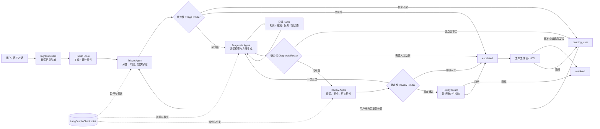
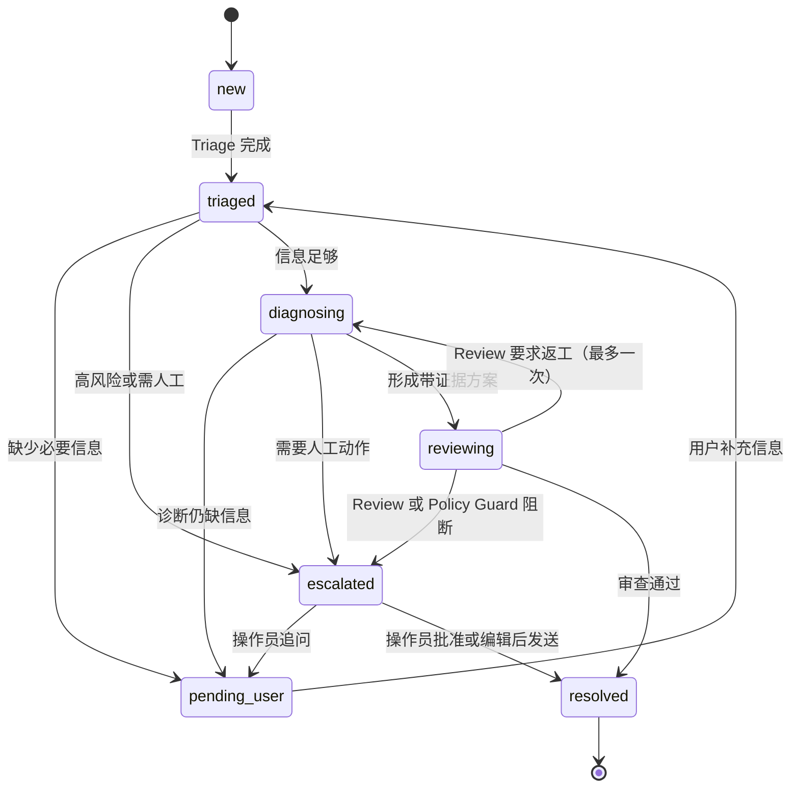

<div align="center">

# KeyGuard 2.0｜多 Agent 硬件钱包售后工单协同系统

**一个可本地复现、可观测、带安全边界与人工接管的 LangGraph 工单编排 Demo**

[](https://www.python.org/)
[](https://github.com/langchain-ai/langgraph)
[](https://streamlit.io/)

[在线体验](https://ai-hardware-cs-agent.streamlit.app/) · [部署说明](./DEPLOYMENT.md) · [5 分钟演示脚本](./docs/DEMO_SCRIPT.md)

</div>

## 项目定位

KeyGuard 2.0 把“模型回答一个问题”升级成“多个职责受限的 Agent 协同处理一张售后工单”。系统用虚构品牌和模拟数据演示硬件钱包的蓝牙连接、固件修复、敏感信息泄露、保修判断等流程；它不接触真实客户或真实资产，也不是生产客服系统。

V2 默认走显式 LangGraph `StateGraph`：先在写入数据库前清理敏感信息，再由 Triage Agent、Diagnosis Agent、Review Agent 分工处理，最后经过确定性策略检查。遇到高风险内容、需要用户补充信息或需要设备重置等动作时，流程停在可解释的状态，等待用户或人工操作员继续。

在线地址展示的是所配置分支的部署结果，行为取决于部署提交、Secrets 和持久化环境，不能据此断言线上部署已经同步本仓库的 V2 代码。需要核验完整链路时，请按“本地启动”复现。

## V1 → V2

| 维度 | V1：单 ReAct 对话 | V2：工单编排 |
|---|---|---|
| 核心对象 | 一段聊天上下文 | 带版本、状态和审计事件的工单 |
| 决策方式 | 模型在一次 ReAct 循环中选择工具 | 三个 Agent 分工，Router 用确定性代码决定下一跳 |
| 流程状态 | 隐含在消息历史中 | 7 个显式业务状态，可暂停、恢复和审计 |
| 安全控制 | Prompt 约束为主 | Ingress Guard 前置脱敏 + Policy Guard 输出校验 + 风险粘性 |
| 返工边界 | 无独立次数约束 | Review 最多一次返工，防止图循环失控 |
| 人工协同 | 以聊天回答为主 | 工作台执行批准、编辑后发送、追问用户、拒绝 |
| 持久化 | 对话与档案 | 工单 SQLite + LangGraph checkpoint SQLite |
| 兼容性 | `KEYGUARD_AGENT_VERSION=v1` 可保留旧链路 | 默认 `KEYGUARD_AGENT_VERSION=v2` |

## 系统架构



### 七状态工单图



状态集合固定为 `new`、`triaged`、`diagnosing`、`reviewing`、`pending_user`、`escalated`、`resolved`。状态和事件用于解释流程，不把模型的自由文本当成控制面。

## 为什么是三个 Agent

| 角色 | 只负责什么 | 主要输入 | 结构化输出 |
|---|---|---|---|
| Triage Agent | 识别意图、风险和必要字段是否齐全 | 已脱敏问题、工单上下文 | 类别、风险、缺失字段、路由建议 |
| Diagnosis Agent | 调用只读工具收集证据，提出下一步方案 | 分诊结果、用户补充、工具结果 | 证据、引用、建议动作、答复草稿 |
| Review Agent | 检查证据充分性、安全性和可执行性 | 诊断产物、策略上下文 | 通过、一次返工或升级人工 |

拆成三个角色是为了让每一步的输入、输出和失败边界都能测试。**Router 不是 Agent**：它不调用模型，只根据结构化字段、允许的状态迁移和安全规则决定下一节点，因此同一状态下的控制流可重复验证。

### Agent 与 Tool 边界

Agent 负责理解和生成；Tool 负责返回事实。工具不替模型“思考”，Agent 也不能改写工具的事实结果。

| 只读 Tool | 用途 | 数据边界 |
|---|---|---|
| `knowledge_search` / RAG | 检索排障与安全条目，返回引用 | 本仓库 72 条 source-backed 客服条目 |
| Profile Tool | 获取演示用户的设备与偏好上下文 | 本地模拟 SQLite 数据 |
| Warranty Tool | 按序列号后四位查询保修证据 | 模拟保修记录，不连接厂商系统 |
| Chain Status Tool | 解释交易 pending 等链状态 | 模拟状态，不代表实时链上数据或费率 |

设备重置、bootloader 恢复、钱包恢复、保修结论等具有影响的动作不会被 Tool 自动执行，而是进入 Human-in-the-loop。

## 安全、可靠性与 Human-in-the-loop

- **Ingress Guard**：在内容写入工单或 checkpoint 之前识别助记词、私钥等秘密并脱敏；后续节点只看到清理后的文本。
- **Policy Guard**：在答复离开系统前做确定性校验，阻断索要或复述秘密、证据不足以及越权动作。
- **风险粘性**：工单一旦被判为高风险，后续轮次不能仅靠模型输出把风险静默降级。
- **最多一次返工**：Review 可把诊断退回一次；再次失败转人工，避免无限循环。
- **可恢复执行**：工单数据库保存业务状态，独立 checkpoint 数据库保存图执行位置；超时、有限重试和命令租约降低重复执行风险。
- **人工操作面**：工单工作台提供批准、编辑后发送、向用户追问、拒绝等动作。未配置 `KEYGUARD_OPERATOR_TOKEN` 时工作台默认关闭，而不是匿名开放。

## 两个界面、四条演示路径

Streamlit 页面有两个标签页：**客户对话**用于提交问题和补充信息，**工单工作台**用于查看状态、证据、审计记录并执行人工动作。

| 场景 | 输入示例 | 应观察到的编排行为 |
|---|---|---|
| 蓝牙故障 | “蓝牙连不上手机，系统和 App 都是最新版。” | 自动分诊、检索证据、Review 后 `resolved`，答案带来源 |
| 固件中断 | “升级固件时断开了，现在怎么办？” | 因缺少设备型号或错误状态进入 `pending_user`；补充后重新分诊 |
| 助记词泄露 | 在问题中粘贴测试助记词 | 入库前脱敏、显示固定安全提示、风险保持并进入 `escalated` |
| 保修判断 | 提供演示序列号后四位 `A1B2` | 查询模拟保修证据；涉及保修结论时等待人工处理 |

完整讲解顺序见 [docs/DEMO_SCRIPT.md](./docs/DEMO_SCRIPT.md)。

## RAG 数据与来源

`data/` 下 5 个知识文件覆盖故障排除、固件升级、安全使用、助记词与备份、交易与链网络，共 **72 条 source-backed 客服条目**。内容依据公开的官方支持页和协议标准重新组织为 KeyGuard 客服格式；“source-backed”表示可追溯参考，不表示获得任何真实品牌授权。

| 方向 | 代表性参考 |
|---|---|
| USB / 设备识别 | [Ledger USB connection issues](https://support.ledger.com/article/115005165269-zd)、[Trezor device issues](https://trezor.io/support/troubleshooting/device-issues/trezor-suite-doesn-t-see-my-device) |
| 蓝牙 | [Ledger Bluetooth setup](https://support.ledger.com/article/360019138694-zd)、[pairing issues](https://support.ledger.com/article/360025864773-zd) |
| 固件 | [Ledger OS update](https://support.ledger.com/article/360013349800-zd)、[Trezor firmware issues](https://trezor.io/support/troubleshooting/device-issues/firmware-update-issues) |
| 备份与派生 | [BIP39](https://github.com/bitcoin/bips/blob/master/bip-0039.mediawiki)、[BIP44](https://github.com/bitcoin/bips/blob/master/bip-0044.mediawiki)、[Trezor backups](https://trezor.io/learn/security-privacy/personal-security-standards/understanding-trezor-wallet-backups-12-20-or-24-words) |
| Passphrase | [Ledger Passphrase](https://www.ledger.com/academy/passphrase-an-advanced-security-feature)、[Trezor hidden wallets](https://trezor.io/support/troubleshooting/trezor-suite-issues/passphrase-hidden-wallets-issues) |
| 交易边界 | [Ethereum gas](https://ethereum.org/developers/docs/gas/)、[Bitcoin RBF](https://bitcoincore.org/en/faq/optin_rbf/)、[WalletConnect](https://docs.walletconnect.network/wallet-sdk/overview) |

检索默认使用本地 1024 维 Hash Embedding 和 Chroma 缓存 `chroma_db_v1/`。它方便 Demo 离线启动，但不等价于生产级语义向量模型。

## 48 条离线评测

V2 的 [multi_agent_cases.json](./eval/multi_agent_cases.json) 共 48 条：**30 条继承 + 18 条新增**，覆盖 happy path、信息补充、敏感信息、人工升级、恢复执行和状态转移。评测关注路由、状态、脱敏、证据、引用和人工接管等可观察结果，不应把单一数字包装成生产业务指标。

仓库内已有的 [wallet-rag-v2.json](./eval/eval_results/wallet-rag-v2.json) 是 V1 的 30 题结果，记录的是 **83.3% 关键词覆盖率**，不是答案准确率，也不是 V2 多 Agent 评测结果。

V2 runner 是显式注入接口。只有接入真实 orchestration runner 后才执行并保存结果：

```bash
export KEYGUARD_ORCHESTRATION_EVAL_RUNNER=module:attribute
python eval/run_orchestration_eval.py --tag keyguard-v2
```

未配置 runner 时脚本会 **fail closed**：退出失败且保持**零输出**，不会伪造 `keyguard-v2.json`。因此仓库不预填未实测的 V2 分数；演示时应现场运行后再展示混淆矩阵和 bad case。

## 本地启动

```bash
git clone https://github.com/ruiqiyang123/ai-hardware-cs-agent.git
cd ai-hardware-cs-agent
python3 -m venv .venv
source .venv/bin/activate
pip install -r requirements.txt
cp .env.example .env
python scripts/init_knowledge_base.py
pytest -q
streamlit run app.py
```

至少填写 `MIMO_API_KEY`，并确认 `CHAT_PROVIDER=mimo`，否则模型工厂可能回退到 DashScope；需要使用工单工作台时再设置不可猜测的 `KEYGUARD_OPERATOR_TOKEN`。完整 Secrets 和数据库路径说明见 [DEPLOYMENT.md](./DEPLOYMENT.md)。

## 代码导览

| 路径 | 作用 |
|---|---|
| [app.py](./app.py) | 两个标签页、V1/V2 入口、操作员认证与人工动作 |
| [agent/orchestration/](./agent/orchestration) | StateGraph、状态、Router、事件、调用与运行时边界 |
| [agent/nodes/](./agent/nodes) | Triage / Diagnosis / Review 节点 |
| [agent/policies/security.py](./agent/policies/security.py) | 输出策略与风险控制 |
| [agent/security/](./agent/security) | 秘密检测、脱敏与可信来源规则 |
| [agent/tools/](./agent/tools) | RAG、档案、保修等工具适配层 |
| [database/ticket_db.py](./database/ticket_db.py) | 工单、版本和审计事件持久化 |
| [eval/run_orchestration_eval.py](./eval/run_orchestration_eval.py) | 可注入 runner 的 V2 离线评测入口 |
| [tests/](./tests) | 路由、状态机、安全、持久化、恢复和文档合约测试 |

## 已知限制

- 所有品牌、用户、序列号、保修、设备、链状态和业务案例均为模拟或演示数据；项目不处理真实资产。
- 本地 Hash Embedding 主要用于降低运行门槛，语义召回能力不能代表生产模型；知识条目也需要正式内容审核和持续更新。
- 工单与 checkpoint 使用两个 SQLite 文件，适合单实例 Demo。Streamlit Cloud 文件系统可能重启或重部署，数据是易失的，不能视为生产持久化。
- `KEYGUARD_OPERATOR_TOKEN` 是 Demo 级共享令牌，不包含企业级身份、权限分层、轮换和完整审计体系；未配置时工作台关闭。
- 外部保修与链状态工具均为模拟实现，没有连接厂商售后、真实区块链 RPC 或资产操作接口。
- V2 评测框架和 48 条案例已经就绪，但仓库不包含未经真实 runner 执行的结果，不应提前填写准确率、成本下降或 SLA。
- 在线体验可能因休眠、配额、部署提交或 Secrets 与本地行为不同；技术核验以固定提交的本地复现为准。
