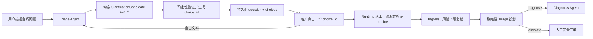

# KeyGuard 动态澄清选择与并发恢复设计

**日期：** 2026-08-03
**状态：** 已获用户口头批准，等待书面规格复核
**范围：** 动态澄清选项、选项恢复、Streamlit 重复 rerun、处理中消息去重

## 1. 背景与问题证据

当前实现把 `clarification_options` 保存为纯字符串。用户点击选项后，UI
只把文字重新作为普通输入提交，Triage Agent 不知道它是上一轮问题的明确选择，
因此可能再次把短文本判断为 `ambiguous` 并生成同一组问题。

本地工单 `KG-C8BEB6015780` 已出现真实循环：用户选择
“App 暂时没有显示余额”后，连续三个命令都执行
`await_user → triage → pending_user`，并再次返回相同澄清问题。

另一个已复现的问题是 Streamlit 在模型仍执行时发生重复 rerun。第二个页面执行
看到同一幂等命令处于 `in_progress`，当前 UI 却把这个可恢复状态替换成
“当前请求未能安全完成”，同时清除处理中标记。后续 rerun 又会追加同一条用户消息，
造成重复问题、重复失败提示；实际上原命令可能稍后正常完成。

## 2. 目标与非目标

### 2.1 目标

1. 澄清选项由 Triage Agent 根据当前问题动态生成，不限制为五个固定方向。
2. 系统能够确定性识别“用户选择了上一轮的哪个选项”，不再让模型重新猜测。
3. 新增任何合规选项时都沿用同一套机制，不需要增加硬编码分支。
4. 同一请求在重复 rerun 时只展示一次用户消息和一个处理中占位。
5. `in_progress` 与可恢复 timeout 不得显示成最终失败。
6. 入口风险检测、风险粘性、Policy Guard 和人工升级白名单保持有效。

### 2.2 非目标

- 不建设生产级消息队列或分布式任务系统。
- 不允许模型直接修改工单状态或绕过 Router。
- 不把所有问题都限制在资产、余额和交易五个方向。
- 不展示模型思维过程或内部异常详情。

## 3. 核心产品规则

### 3.1 动态而非随机

Triage Agent 根据当前已脱敏问题生成 2–5 个与上下文相关、互斥且能够消除歧义的
选项。例如：

- 开机问题：完全没反应、卡在 Logo、连接电源后才有反应；
- 蓝牙问题：搜索不到、配对失败、连接后频繁断开；
- 余额问题：App 同步未显示、恢复后余额为零、交易仍未确认。

选项是上下文驱动的结构化输出，不是随机文案。配置中的五个余额/安全选项仅作为
特定资产问题或 Triage 结构失败时的兜底，不作为全局问题目录。

### 3.2 用户选择的含义只解析一次

Agent 负责生成候选选项及其语义，确定性代码负责验证、编号、保存和恢复。
用户点击后提交 `choice_id`；Runtime 必须从当前工单中加载对应选项，不能相信
客户端回传的 category、route 或 risk 字段。

### 3.3 自由文本继续使用 Agent

如果用户没有点击选项，而是输入新的描述，输入继续经过 Ingress Guard 和
Triage Agent。动态选择机制不会阻止用户换话题或补充其他信息。

## 4. 数据契约

### 4.1 Agent 输出候选项

新增严格模型 `ClarificationCandidate`：

```python
class ClarificationCandidate(StrictModel):
    label: str
    intent: Intent
    category: Category
    risk_level: RiskLevel
    risk_flags: list[RiskFlag]
    missing_fields: list[MissingField]
    suggested_route: Literal["diagnose", "escalate"]
```

`choice_id` 不由模型生成。候选项通过 schema、敏感信息、控制字符、枚举、风险一致性
和 required-fields 校验后，系统根据规范化候选 JSON 与列表位置生成稳定 ID：

```text
choice_<16 位十六进制摘要>
```

同一轮中 ID 和 label 必须唯一。选项本身必须能够结束当前歧义，因此
`suggested_route` 不允许再次为 `clarify`。

### 4.2 持久化状态

Graph state 与 ticket 中保存 `ClarificationChoice`：

```python
class ClarificationChoiceState(TypedDict):
    choice_id: str
    label: str
    intent: str
    category: str
    risk_level: str
    risk_flags: list[str]
    missing_fields: list[str]
    suggested_route: str
```

`clarification_question` 继续单独保存。原 `clarification_options_json` 改为保存上述
对象数组，数据库 `SCHEMA_VERSION` 从 8 提升到 9。

迁移时，旧字符串选项转换为带稳定 ID 和 label 的 legacy choice。legacy choice
没有可信路由元数据，用户选择后会携带明确的“来自上一轮选项”上下文重新进入
Triage；新版本生成的 choice 才走完全确定性的恢复路径。迁移不删除旧工单。

### 4.3 客户端提交

UI 选择命令只提交：

```text
ticket_id + choice_id + request_id
```

Runtime 从 Repository 读取 label 和结构化语义，验证：

1. ticket 仍为 `pending_user`；
2. `waiting_reason == clarification`；
3. `choice_id` 属于该工单当前版本的选项；
4. 该选择没有被新一轮问题替换；
5. command id、payload fingerprint 与幂等约束一致。

不满足条件的陈旧或伪造选择被安全拒绝，不执行模型、工具或人工升级副作用。

## 5. 编排数据流



恢复 choice 后仍经过入口风险下限检查。choice 的风险只能维持或提高当前工单风险，
不能降低已有风险。高风险 choice 仍必须满足自动升级白名单；普通设备与交易问题继续
诊断，不因选项机制进入人工。

成功消费 choice 后必须清空上一轮 question 和 choices，避免同一个 ID 被下一轮再次使用。

## 6. Streamlit 并发恢复

### 6.1 两阶段提交

客户提交拆成两次页面执行：

1. **入队阶段：** 冻结安全 payload 和请求前历史；追加一次用户消息和一次处理中占位；
   设置 `PENDING_UI_REQUEST_SESSION_KEY`，立即 rerun。
2. **执行阶段：** 页面先根据 pending 标记禁用聊天输入、示例问题、澄清按钮、结案和
   人工按钮，再执行或恢复同一幂等命令。

这样浏览器会在模型调用开始前收到“控件已禁用”的页面，不给重复点击留下窗口。

### 6.2 状态展示

| Command 状态 | UI 行为 |
|---|---|
| 尚未创建 | 使用冻结 payload 创建一次 |
| `in_progress` | 保留原处理中占位，显示“仍在处理”，每 2 秒最多检查一次持久化 command 状态 |
| lease 到期且可恢复 | 使用同一 request id 从 checkpoint 恢复 |
| `completed` | 从 Repository 读取安全结果，原位替换处理中占位 |
| `failed` / checkpoint 不一致 | 只显示一次通用安全失败，并清理冻结状态 |

`CommandInProgressError` 和可恢复 `TimeoutError` 不再调用 `_finish_ui_message`，也不清除
pending 标记。只有确定的 terminal failure 才能把占位替换成失败消息。

自动检查由只读 Streamlit fragment 完成：每 2 秒读取一次 command 状态；只有发现
`completed`、`failed` 或 lease 已到期时才触发一次完整页面 rerun。检查必须复用同一个
request id，不能生成新 command。检查期间不重复追加消息，不再次执行准备逻辑，
不把当前输入加入 safe history 两次。

## 7. UI 行为

- 动态选项显示为按钮，按钮 key 使用 `ticket_id + choice_id`，不使用 label 截断值。
- pending command 存在时，所有会产生客户命令的控件禁用。
- 页面始终只保留一个输入框，位于对话底部。
- 用户选择后，聊天记录展示选项 label，而不是内部 choice ID。
- 完成后在同一位置显示诊断回答、下一轮新问题或人工升级状态。
- 不能向客户展示 command、checkpoint、Schema、traceback 或异常类型。

## 8. 安全与错误边界

1. 候选 label 在持久化前执行秘密检测和长度/控制字符校验。
2. 客户端只提供 choice ID，所有语义字段由服务端 Repository 读取。
3. choice 风险字段执行与 TriageResult 相同的风险一致性校验。
4. 明确助记词/私钥泄露、未经授权转账、钓鱼、地址或签名异常仍按现有白名单升级。
5. 普通设备、同步、恢复和交易 pending 选项不得仅凭关键词自动升级。
6. 选项校验失败时保持工单开启，返回新的安全澄清，不执行旧 choice。
7. 未通过 Review 或 Policy Guard 的草稿仍不得发送。

## 9. 测试与验收

### 9.1 动态选项

- 开机、蓝牙、固件、恢复和交易五类输入生成各自相关的动态选项；
- 测试运行时生成一个仓库中从未硬编码的新 label，点击后仍能根据其 choice metadata
  进入正确诊断，证明实现不依赖固定五项；
- choice ID 稳定、唯一、可持久化，label 不重复；
- 非 ambiguous 输出不得携带 choices。

### 9.2 选择恢复

- 点击当前 choice 后不再调用 LLM Triage runner，直接进入确定性投影；
- choice 只消费一次，消费后清空；
- 陈旧、跨工单、篡改和未知 ID 全部拒绝；
- 高风险 choice 自动升级，低风险 choice 保持 AI 诊断；
- 自由文本仍调用 Triage Agent。

### 9.3 并发与 UI

- 同一个 request 在 `in_progress` 时重复 rerun，不新增消息、不显示失败；
- 原命令完成后，处理中占位被正式答案原位替换；
- timeout 恢复继续使用相同 request id；
- terminal failure 只出现一次安全失败提示；
- pending 期间输入、示例按钮和澄清按钮均禁用。

### 9.4 回归验收

手工验收顺序：

1. 输入含糊的开机问题，获得开机相关动态选项；
2. 点击一个选项，只出现一次用户选择；
3. 系统进入诊断或给出更具体且不同的问题，不重复原选项；
4. 在 DeepSeek 响应期间尝试重复点击，控件不可用且不会出现假失败；
5. 输入新的自由文本问题，仍可正常连续追问；
6. 运行完整 pytest、compileall 和 `git diff --check`。

## 10. 发布与兼容

- 数据库 schema 升级到 v9，保留 v8 自动迁移；
- 编排契约版本升级，强制 Streamlit 重建缓存的 Orchestrator；
- README 同步动态澄清、确定性选择恢复和并发恢复规则；
- 本地验证通过后再提交代码；是否推送 GitHub 由用户单独决定。

## 11. 成功标准

满足以下全部条件才视为完成：

1. 用户点击 AI 动态生成的任意合规选项后，不会再次收到完全相同的问题和选项；
2. 新选项不需要新增 Python 硬编码路由；
3. `in_progress` 不再显示为安全失败，也不会重复追加消息；
4. 低风险连续追问保持 AI 处理，高风险白名单仍能自动升级；
5. 全量自动化测试和本地连续对话验收通过。
